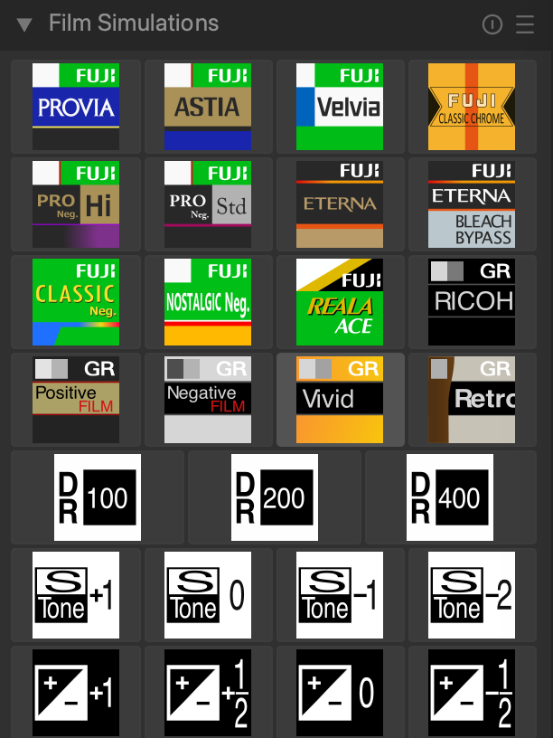

# Darktable Film Simulation Panel

A graphical panel in darktable's lighttable and darkroom for applying presets.

This darktable extension consists of

- a Lua script that adds a "Film Simulations" panel to the darkroom and lighttable
- a *user.css* and a number of icons for putting images on the panel's buttons
- a number of styles, which the buttons apply

The supplied styles are:
- Fuji/Provia
- Fuji/Astia
- Fuji/Velvia
- Fuji/Classic Chrome
- Fuji/Pro Neg High
- Fuji/Pro Neg Std
- Fuji/Eterna
- Ricoh/Ricoh Standard
- Ricoh/Positive Film
- Ricoh/Negative Film
- Ricoh/Vivid
- Ricoh/Retro
- Ricoh/Bleach Bypass (not included in panel)
- Ricoh/Cross Processing (not included in panel)
- 4 × Shadows (simple tone curve RGB adjustments)
- 4 × Exposure (simple exposure adjustments)
- DR100, DR200, DR400 (tone equalizer presets for raising shadows/midtones by 0/1/2 EV)

Not all styles are applicable to all images. *Fuji* and *Ricoh* styles are targeted to Fuji/Ricoh cameras, and won't apply to others. This is implemented by simple EXIF-maker matching with the style prefix (`Fuji/`, `Ricoh/`) in the lua script.

Adding a new button to the Film Simulations panel involves:
- adding the button in *FilmSimPanel.lua* using `darktable.new_widget`, and giving it a unique `name`
- adding the button name to the class at the beginning of *user.css* to style it as a panel button
- adding a unique entry at the end of *user.css* to give it an icon

## Installation

Copy the contents of the repository (excluding *README.md* and *screenshot.png* and *styles_source*, although they won't hurt) to your darktable configuration directory (e.g. *~/.config/darktable* or *~/.var/app/org.darktable.Darktable/config/darktable*), activate the FilmSimPanel lua script, and you should be good to go.

The styles are meant to be applied after Sigmoid with 1.5 Contrast, 0 skew, per-color processing with 50% preserve hue in darktable 4.2.1.

## Known Issues

In some versions of Darktable, applying a style using `darktable.styles.apply` in the darkroom crashes darktable. The reasons for this are as of yet unknown. A [bug report](https://github.com/darktable-org/darktable/issues/13985) has been filed. You can apply the styles without issue from the styles menu, or in the lighttable panel.

The Film Simulation Panel currently works around this by using the `darktable.gui.action` interface instead if in the darkroom view. This might behave strangely in edge cases, such as multiple images in the current selection, or if the style names contain untested characters (`/` is appropriately escaped, but others might need escaping as well).

## Background

The styles were compiled using *darktable-chart*:

- edit your *darktablerc* and set `allow_lab_output=TRUE`
- export each of the JPEGs in *style_source* as PFM (only available with the above edit)
- export the two RAF/DNG as PFM as well, make sure white balance is set on the middle grey patch, and that the input profile is in its default state, and that only a bare minimum of modules is active
- run `darktable-chart` or `flatpak run --command=darktable-chart org.darktable.Darktable`
- select the exported RAF/DNG and the supplied *color_checker.cht* in the first tab (and adjust boundaries to match image, increase scale if necessary)
- select the exported JPEG in the second tab (also adjust boundaries)
- calculate and export in the third tab. If the difference is inf, check the masks in the first and second tab. I like to export only tone curve and color lookup table. Don't forget to set a style name.

The supplied target images were shot in sideways midday sunlight, white-balanced on a sheet of white paper. They were processed in-camera to the various film simulations.

When exporting the RAF/DNG target PFM, set up darktable to your preferred baseline. In my case, I want the style to apply after Sigmoid, so I include Sigmoid with my default settings in the RAF/DNG. As a fun diversion, you can mix and match source and target files as you please, for example, you can readily create a style for replicating Ricoh's "Positive Film" simulation from a Fuji camera.
